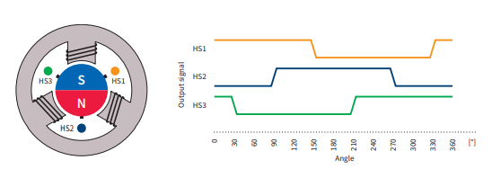
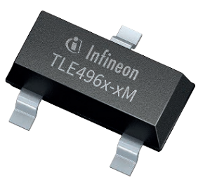
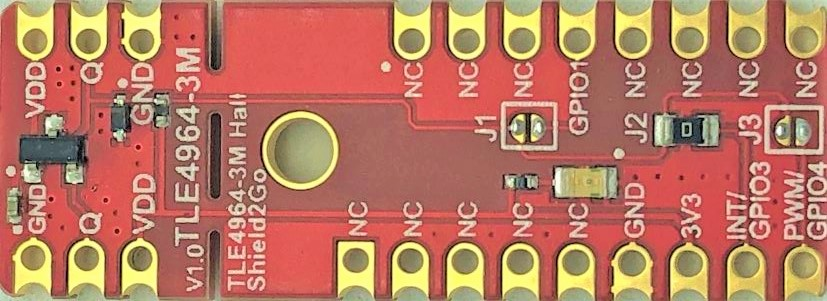
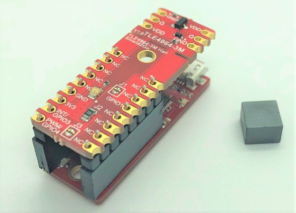

# Hall-Switch

[](https://travis-ci.com/Infineon/hall-switch)

C++ library of Infineon **single Hall-effect switch** family for magnetic sensing applications

 1. [Overview](#ovw)
 2. [Supported Hardware](#s-hw)
 3. [Software Requirements](#sw-req)
 4. [Library Usage](#lib-usage)
 5. [Demo Application Example](#demo-ex)
 6. [References](#refs)

<a name="ovw"></a>

## 1. Overview

###  Single Hall Switch Family 

Infineon offers a great variety of single output hall-effect switches for consumers, industrial, and automotive magnetic sensing applications. A broad selection of packages, and voltage, temperature and magnetic sensing operating ranges is available. These integrated circuits allow to create accurate, energy saving and compact systems, as required in brushless DC commutation and position detection applications.

Find the most suitable product for your system on the Infineon Hall Switches [website](https://www.infineon.com/cms/en/product/sensor/magnetic-sensors/magnetic-position-sensors/hall-switches/) and its product selection guide documentation.  

 

<a name="s-hw"></a>

## 2. Supported Hardware

### TLE4964-3M Shields2Go
The library has been customized for the **TLE4964-3M** Shields2Go and the Arduino environment. 



The complete documentation as schematic and pinout diagram of the boards is included in the **Quick Start Guide**:
* [TLE4964-3M S2Go]() (cooming soon)

### Verified Hardware Platforms

The library examples have been built and successfully executed on the following hardware platforms:

MCU Platforms |
---           |
[XMC 2Go](https://www.infineon.com/cms/en/product/evaluation-boards/kit_xmc_2go_xmc1100_v1/) | 
[XMC1100 Boot Kit](https://www.infineon.com/cms/en/product/evaluation-boards/kit_xmc11_boot_001/#ispnTab1) |
[XMC4700 Relax Kit for 5V Shields](https://www.infineon.com/cms/en/product/evaluation-boards/kit_xmc47_relax_5v_ad_v1/) |
[Arduino Uno Rev3](https://store.arduino.cc/arduino-uno-rev3) |   

The Shield2Go form factor is designed to be stacked directly into the XCM 2Go microcontroller board. The [MyIoT Adapter Shield](https://www.infineon.com/cms/en/product/evaluation-boards/my-iot-adapter/) can be used to attach the Shield2Go with any Arduino UNO hardware compatible boards. 


The firmware pin allocation is configured for the usage of **Socket 2/3** of the MyIoT Adapter Shield. The **Socket 1 configuration is not available**.


Check the [Quick Start Guide](https://www.infineon.com/dgdl/Infineon-quick_starter_guide-Shield2Go_MY_IoT_Adapter-GS-v01_00-EN.pdf?fileId=5546d462677d0f460167bbdbd8521af9) for the complete information and pinout diagram of the MyIoT adapter.

#### Additional hardware platforms 

The library is meant to be directly compatible with any other Arduino UNO platforms. Any new validated hardware platform will be added to the MCU Platforms list above.

For any other custom configuration, please check the specific PCB documentation. The information about the IC component can be found in the respective TLE4964-3M [datasheet](https://www.infineon.com/dgdl/Infineon-TLE4964_3M-DS-v01_00-en.pdf?fileId=db3a30433cabdd35013cc94b7c0f64f9).

#### Additional compatible sensors

Although there is no official Shield2Go or evaluation PCB, this firmware library can be configured to operate any single output open collector hall switch of the Infineon family.

In fact, this library can be used with any generic active-low single output binary sensor ;)

Find out more about particular hall switches and their features on the link to the Infineon product website in [References](#refs) section. 

<a name="sw-req"></a>

## 3. Software Requirements

### Supported Toolchain Software 

The library examples has been built successfully with the following toolchain software:

Framework | IDE         | Versions                    | MCU Platform Core Libs        | Versions  
---       | ---         |---                          | ---                           |--- 
Arduino   | Arduino IDE | 1.8.9                       | [XMC for Arduino](https://github.com/Infineon/XMC-for-Arduino)     | 1.2.1     
Arduino   | PlatformIO  | Home 2.0.2·Core + 4.0.0a8   | [Infineon XMC](https://github.com/Infineon/platformio-infineonxmc) | 1.1.2 

### Software Dependencies

There are no additional library dependencies required by the Hall Switch library or its examples other than the **MCU Platform Core Libs** (check how to install them in the Library Usage [section](#lib-usage)).

<a name="lib-usage"></a>

## 4. Library Usage

### Source Code Documentation

Find the source code documentation in **Doxygen** format on the following [link](https://infineon.github.io/hall-switch/).

### Arduino IDE

If you are new to Arduino IDE, please [download](https://www.arduino.cc/en/Main/Software) and install it first.

The official Arduino Boards are already available in the IDE, but other third party boards as the Infineon XMC MCU based need to be explicitly included. Follow the instructions in the [link](https://github.com/Infineon/XMC-for-Arduino#installation-instructions) to add the XMC board family to Arduino. Once installed, you can select the one of the supported board from the menu *Tools > Board:...* and configure its parameters.

Then we simply need to install the library to use it in your project:

1. **Install the library**. Download this library as a .zip file (get the latest release version [here](https://github.com/Infineon/hall-switch/releases)). Install the library in the Arduino IDE in the menu *Sketch > Include Library > Add .ZIP library*.

2. **Include it in your sketch**. With the library installed in the Arduino IDE, you can include it from the menu "Sketch > Include Library > Hall-Switch". The header ``` #include <hall-switch-ino.h> ``` will be added to your sketch. You can also open and test one of the examples provided in  *File > Examples > Hall-Switch* (find an example in the [Demo Application Example](#demo-ex) section).

### PlatformIO 

If you are new to PlatformIO, download and install first Visual Studio Code and the PlatformIO plugin. Please follow the instructions on the [official website](https://docs.platformio.org/en/latest/ide/pioide.html). Then go through [this tutorial](https://diyprojects.io/install-ide-platformio-extension-visual-studio-code-vscode-windows-32-bit-linux/#.XOVQP44zYnI) to get started with PlatformIO in VSCode and create a new project. 

With the project created, now the library and its dependencies can be configured in the ***Platform.ini* Project File**. This file, located in the project root folder, includes one (or several) building environments *[env:__]*. In the *environment* section, the platform, board, and framework are specified. PlatformIO will take care of downloading and installing all dependencies.
In the following example, we use the XMC 2Go Evaluation Kit (only available for Arduino):

```
[env:xmc1100_xmc2go]
platform = infineonxmc
board = xmc1100_xmc2go
framework = arduino

lib_deps =
# Using a library name
hall-switch
    
# Using the repository URL
    https://github.com/Infineon/hall-switch.git#master
```

### Pin Configuration

The pin configuration can be found in *hw-platf/hall-switch-platf-ard.c*. The corresponding output and power pins are allocated for the hardware stacks "Shield2Go + XMC 2Go" and "Shield2Go + MyIoT Adapter + Arduino UNO Form Factor boards" :

```
#ifdef XMC1100_XMC2GO                                       /**< xmc2go + Shield2Go  */ 
ArdHwPlatfPins_t TLE4964_3M_S2Go_Pins = {9, UNUSED_PIN};    /**< Pin connected to Q1 */                                                      
#elif ((XMC1100_Boot_Kit) \
      || (XMC4700_Relax_Kit) \
      || (ARDUINO_AVR_UNO))                                 /**< xmc arduino and arduino uno boards */  
ArdHwPlatfPins_t TLE4964_3M_S2Go_Pins = {3, UNUSED_PIN};    /**< Pin connected to Q1 */
#else
    # error "Board not yet defined. Please define the specific Arduino boards Pins"
#endif
```

Other pin configurations can be added here for different Arduino boards and its variants. In order to automatically select the MCU board (or family), the *board* and *board_variant* defines (``` XMC1100_XMC2GO ``` or ``` ARDUINO_AVR_UNO ```) in the *board.txt* file specification have been used. 

### Other hardware platforms and frameworks

The hardware interfaces for the Arduino hardware platforms have been implemented using the [Arduino reference](https://www.arduino.cc/reference/en/) libraries. 

Additional hardware interface implementations can be added here for other platforms, MCU core libraries, toolchains and frameworks based on C/C++. 
Currently, no toolchain or framework integration other than Arduino is provided.

<a name="demo-ex"></a>

## 5. Demo Application Example

Go now to the Arduino IDE and install the library (following the instructions in [Library Usage - Arduino IDE](#lib-usage) section). Open one of the examples in *File > Examples > Hall-Switch > lib-interrupt*. 



After selecting the board (Tools > Board > XMC1100 2Go*), and the proper COM port ( *Tools > Port*), the example sketch can be verified  and uploaded to the target . 

Finally, we can check the monitor output . Do not forget to select the proper baudrate. Just move a magnet near the sensor and check the output field value changing from ON to OFF. Also the XMC2Go LED will turn on with the magnetic field presence :) 

 

<a name="refs"></a>  

## 6. References

### Related Products
* [Infineon Hall Switches Family](https://www.infineon.com/cms/en/product/sensor/magnetic-sensors/magnetic-position-sensors/hall-switches/)
* [TLE4964-3M Shield2Go](https://www.infineon.com/cms/en/product/evaluation-boards/s2go_hall_tle4964-3m/) 
* [XMC 2Go](https://www.infineon.com/cms/en/product/evaluation-boards/kit_xmc_2go_xmc1100_v1/) 
* [XMC1100 Boot Kit](https://www.infineon.com/cms/en/product/evaluation-boards/kit_xmc11_boot_001/#ispnTab1) 
* [XMC4700 Relax Kit for 5V Shields](https://www.infineon.com/cms/en/product/evaluation-boards/kit_xmc47_relax_5v_ad_v1/) 
* [Arduino Uno Rev3](https://store.arduino.cc/arduino-uno-rev3) 

### Related Repositories
 - [Infineon Github](https://github.com/Infineon)
 - [XMC for Arduino](https://github.com/Infineon/XMC-for-Arduino)
 - [Infineon XMC Platformio](https://github.com/Infineon/platformio-infineonxm)

### Useful Links
 - [Infineon for Makers](https://www.infineon.com/cms/en/tools/landing/infineon-for-makers/)
 - [Arduino](https://www.arduino.cc/)
 - [PlatformIO](https://platformio.org/)
